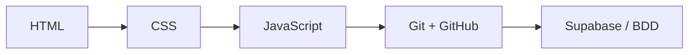
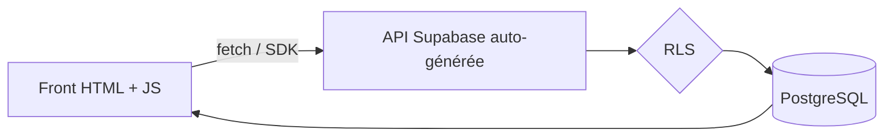
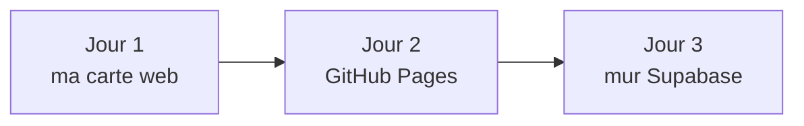

# Intro web : le plan (doc interne)

> Doc de pilotage formateur. N'apparaît **pas** dans le site vu par les apprenants (la page d'accueil du site, c'est `accueil.md`).

## L'idée

- Public qui sait déjà vibecoder (hackathon : user stories, personas, mock-ups donnés à une IA).
- Objectif ici : descendre d'un cran, comprendre le code qu'on écrit.
- On recrée à la main ce qu'ils ont prototypé, mais en sachant ce qu'on fait.

## Ce qu'on introduit

- **Git et GitHub** : versionner et publier.
- **HTML / CSS / JS** : les trois langages du front, dans cet ordre.
- **Supabase** : interagir avec une base de données depuis le front, sans backend.



## Contraintes posées

- Public jeune, en retour à l'emploi, culture info correcte mais pas de fond technique solide.
- Il faut que ce soit **très ludique**.
- Pas rapides : **séparer le principal du secondaire** (les lents finissent le cœur, les rapides ont du bonus).
- Progression imposée : HTML + CSS purs, puis JS seul, puis JS par-dessus le HTML.
- Hébergement GitHub + GitHub Pages. Git en ligne de commande = bonus, sinon upload web.
- Supabase si possible **sans backend**, juste depuis le front via la Data API.
- On aime **plusieurs rendus**, dont des Markdown / Google Docs explicatifs.
- Durée visée : **2 à 3 jours à 7h**.

## Choix technique : Supabase seul suffit

- Pas de Node-RED ni d'Express.
- Dès qu'on crée une table, Supabase génère une **API REST** automatiquement (PostgREST).
- On fait le CRUD **directement depuis le navigateur**.
- La **clé anon** est publique, c'est prévu : ce n'est pas une fuite.
- Le garde-fou, c'est **RLS** (Row Level Security). Sans RLS, la clé anon = accès total dangereux.
- Pour notre mur public : règle « tout le monde lit + insère », pas besoin d'auth.
- Point pédago : expliquer pourquoi cette règle serait catastrophique sur des données sensibles.
- Référence : <https://supabase.com/blog/simplify-backend-with-data-api>



## Le fil rouge

- **Jour 1** : « ma carte web ». Carte de profil en HTML, puis CSS, puis une interaction JS.
- **Jour 2** : « en ligne ». Mise en ligne sur GitHub Pages + une feature JS au choix.
- **Jour 3** : « le mur de la promo ». Livre d'or partagé branché sur Supabase.
- Le payoff : à la fin, tous les sites des élèves lisent et écrivent dans la même table.



## Planning indicatif (3 jours x 7h)

| Jour | Brief | Cœur (principal ●) | Bonus (○) |
|---|---|---|---|
| 1 | [Brief 1](briefs/brief-1-html-css-js.md) | HTML + CSS + 1 interaction JS + découverte Git/GitHub | animations CSS, thèmes, essayer Git |
| 2 | [Brief 2](briefs/brief-2-github-pages.md) | mise en ligne GitHub Pages + feature JS | Git en ligne de commande |
| 3 | [Brief 3](briefs/brief-3-supabase.md) | lire + écrire dans Supabase | filtres, tri, suppression, RLS |

- Chaque brief sépare le **principal** (à finir) du **bonus**.
- Étapes éclatées en micro-pas, à suivre un par un.

## Le Markdown en fil transverse

- Rendu `JOURNAL.md` imposé à chaque brief (l'élève explique ce qu'il a fait).
- Brief 2 : il écrit un vrai `README.md` qui s'affiche sur son dépôt GitHub.
- But : Markdown **utile**, pas scolaire.

## Pré-requis et matériel

- Navigateur récent + éditeur (VS Code, extension Live Server).
- Compte GitHub (gratuit), créé en amont ou début de jour 2.
- **Un seul projet Supabase partagé**, créé par le formateur, qui distribue l'URL + la clé anon.
- Variante avancée (bonus) : les rapides montent leur propre projet.

## Le site de présentation

- Le contenu vit en **Markdown** dans `accueil.md`, `cours-js.md` et `briefs/`. C'est la seule chose qu'on édite.
- **Python compile** : `python3 tools/build_site.py` régénère `site/index.html`.
- Le script est un outil formateur, les élèves n'ouvrent que le HTML.
- Reconstruire après chaque modif d'un `.md`.
- La page « Cours » embarque un **playground JS** (édite + exécute en direct).
- Pré-requis du build : `pip install markdown pygments`.

## Arborescence

```
web-intro/
├── README.md            ← ce doc interne (hors site)
├── accueil.md           ← accueil du site (apprenant)
├── cours-js.md          ← cours interactif JS et DOM
├── briefs/
│   ├── brief-1-html-css-js.md
│   ├── brief-2-github-pages.md
│   └── brief-3-supabase.md
├── tools/
│   └── build_site.py    ← compile les .md en site (formateur)
└── site/
    └── index.html       ← site généré (ce que voient les élèves)
```
