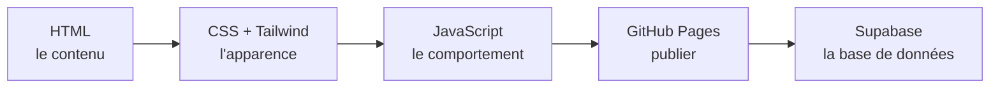
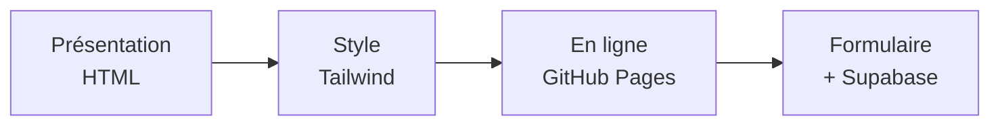

# Bienvenue

- Ce module : construire une page web, la publier en ligne, et la connecter à une base de données. Tout dans un seul projet fil rouge.
- Vous écrivez le code vous-mêmes, étape par étape, pour comprendre comment chaque morceau fonctionne.

## Au programme

- **HTML** : le contenu et la structure de la page.
- **CSS, Tailwind et daisyUI** : l'apparence (couleurs, mise en page, composants prêts à l'emploi).
- **JavaScript** : le comportement, ce qui réagit aux actions de l'utilisateur.
- **GitHub Pages** : publier la page en ligne, sur une adresse publique.
- **Supabase** : enregistrer les messages d'un formulaire dans une base de données, directement depuis la page, sans serveur à développer.

## Le projet

Une seule page, qu'on construit puis qu'on enrichit étape par étape :

- présenter une application (titre, capture, description, lien) ;
- l'habiller avec Tailwind et daisyUI ;
- la publier en ligne sur GitHub Pages ;
- y ajouter un formulaire de contact qui enregistre les messages dans Supabase.

## L'accès à une base de données depuis le navigateur

- La page envoie une requête à l'API de Supabase.
- Supabase interroge la base de données et renvoie les données au format JSON.
- La page affiche le résultat. Aucun serveur à développer.

## Ce que vous saurez faire à la fin

- Lire et modifier une page web.
- L'habiller rapidement avec Tailwind et daisyUI.
- La publier avec une adresse publique.
- Enregistrer des données dans une base depuis la page.
- Rédiger de la documentation en Markdown.

## Méthode de travail

- Les étapes **● principal** sont le cœur du brief : à terminer en priorité.
- Les étapes **○ bonus / facultatif** servent à aller plus loin une fois le principal terminé.
- Tenez un fichier **`JOURNAL.md`** en Markdown à chaque étape.
- La page « Cours » est interactive : utilisez-la pour tester du code.
- Ouvrez le **brief** dans le menu de gauche pour commencer.
