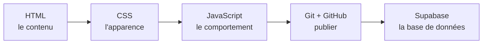
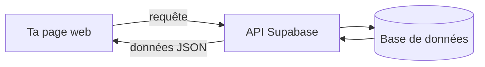

# Bienvenue (:

- Tu sais déjà faire pondre une page par une IA. Cette semaine, on passe sous le capot.
- Le but : écrire le code toi-même, comprendre ce qu'il y a dessous, et le mettre en ligne pour de vrai.
- Pas de magie, pas de blabla : on construit, on casse, on répare.

## Au programme

- **Git et GitHub** : versionner ton code et le publier.
- **HTML** : le contenu et la structure de la page.
- **CSS** : l'apparence (couleurs, formes, mise en page).
- **JavaScript** : le comportement, ce qui réagit quand on clique.
- **Supabase** : interagir avec une vraie base de données, directement depuis le front, sans backend.

## Le fil rouge : un projet qui grandit

- **Jour 1** : ta carte web (HTML, CSS, un peu de JS).
- **Jour 2** : la même carte en ligne sur GitHub Pages, avec une feature sympa.
- **Jour 3** : le mur de la promo, branché sur Supabase. Tout le monde écrit sur la même base.

## Comment ça marche, une base de données depuis le front

- Ta page envoie une requête à l'API de Supabase.
- Supabase parle à la base de données et renvoie les données en JSON.
- Ta page affiche le résultat. Pas de serveur à coder.

## Ce que tu sauras faire à la fin

- Lire et modifier n'importe quelle page web.
- Versionner ton code et le publier avec une vraie URL.
- Brancher une page sur une base de données.
- Écrire de la doc propre en Markdown.

## Comment bosser

- Les étapes **● principal** : à finir, c'est le cœur de la journée.
- Les étapes **○ bonus** : si tu as le temps, pour aller plus loin.
- Tiens un **`JOURNAL.md`** en Markdown à chaque étape.
- Tu bloques ? La page « Cours » est interactive, va y tester du code.
- Choisis un brief dans le menu de gauche, et c'est parti.
