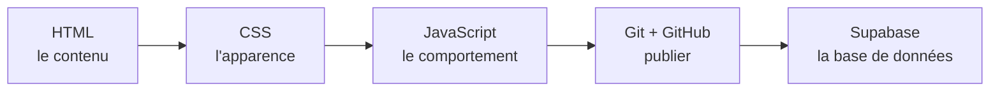

# Bienvenue

- Cette semaine : apprendre à construire une page web, la publier en ligne, et la connecter à une base de données.
- Tu écris le code toi-même, étape par étape, pour comprendre comment chaque morceau fonctionne.

## Au programme

- **Git et GitHub** : suivre les versions de son code et le publier.
- **HTML** : le contenu et la structure de la page.
- **CSS** : l'apparence (couleurs, formes, mise en page).
- **JavaScript** : le comportement, ce qui réagit aux actions de l'utilisateur.
- **Supabase** : lire et écrire dans une base de données, directement depuis la page, sans serveur à développer.

## Le projet de la semaine

- **Jour 1** : ta carte de profil web (HTML, CSS, une première interaction en JavaScript).
- **Jour 2** : mise en ligne de la carte sur GitHub Pages, avec une fonctionnalité supplémentaire.
- **Jour 3** : un mur de messages partagé par la promo, connecté à Supabase.

## L'accès à une base de données depuis le navigateur

- La page envoie une requête à l'API de Supabase.
- Supabase interroge la base de données et renvoie les données au format JSON.
- La page affiche le résultat. Aucun serveur à développer.

## Ce que tu sauras faire à la fin

- Lire et modifier une page web.
- Suivre les versions de ton code et le publier avec une adresse publique.
- Connecter une page à une base de données.
- Rédiger de la documentation en Markdown.

## Méthode de travail

- Les étapes **● principal** constituent le cœur de chaque journée : à terminer en priorité.
- Les étapes **○ bonus** servent à aller plus loin une fois le principal terminé.
- Tiens un fichier **`JOURNAL.md`** en Markdown à chaque étape.
- La page « Cours » est interactive : utilise-la pour tester du code.
- Choisis un brief dans le menu de gauche pour commencer.
